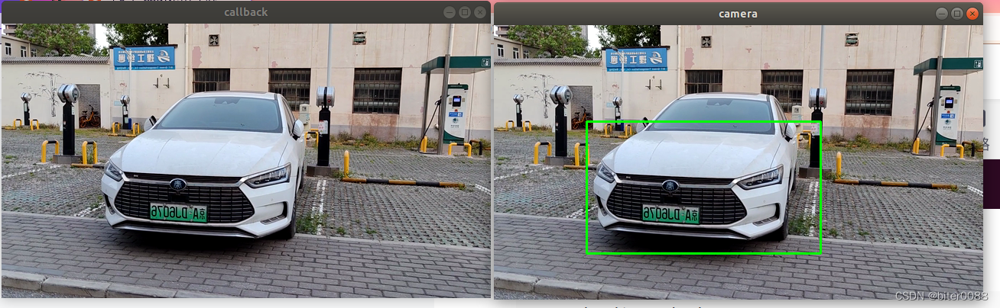

# opencv-cascade-classifier-test

# Note

you need change 22th line in ./src/pub_image/src/imwrite_1.cpp, change the address to your image address.
```c++
srcImage = cv::imread("/home/meng/ivrc/opencv_adaboost/camera_ws/src/pub_image/src/pos_030.png",1);
```


# Build & Run

# Compile:
```bash
catkin_make
```
# Run:

one terminal:  
```bash
roscore  
```

anonther terminal:  
```bash
cd  xxx/opencv-cascade-classifier-test  
source devel/setup.bash  
rosrun pub_image pub_image_node  
```
third terminal:  
```bash
source devel/setup.bash  
rosrun opencv_detect book_detect.py  
```
# the example 
./result_example.png  



# further detail 
CSDN:  
https://blog.csdn.net/BIT_HXZ/article/details/124992751  
